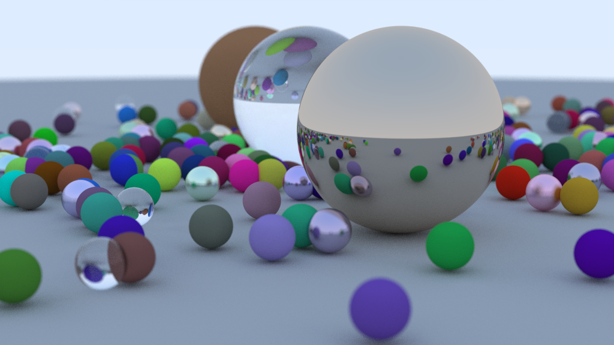

# Ray Tracing in One Weekend in Rust

Personal project for my first Rust practice.

Simple ray-tracer script, used&migrated the algorithms&C++ codes in the article of Peter, Trevor and Steve's [Ray Tracing in One Weekend](https://raytracing.github.io/books/RayTracingInOneWeekend.html).

Final outcome



## Run

```.sh
# install dependencies
cargo install

# run & write stdout into file as `ppm` formatted data
cargo run > output.ppm

# ..or you can use release(optimized) binary for fast execution
cargo build -r
./target/release/rust-tutorial > output.ppm
```

You can easily preview exported ppm file in some website like below:

https://www.cs.rhodes.edu/welshc/COMP141_F16/ppmReader.html

## Acknowledgements

[_Ray Tracing in One Weekend_](https://raytracing.github.io/books/RayTracingInOneWeekend.html)

- Title (series): “Ray Tracing in One Weekend Series”
- Title (book): “Ray Tracing in One Weekend”
- Author: Peter Shirley, Trevor David Black, Steve Hollasch
- Version/Edition: v4.0.0-alpha.1
- Date: 2023-08-06
- URL (series): https://raytracing.github.io/
- URL (book): https://raytracing.github.io/books/RayTracingInOneWeekend.html
